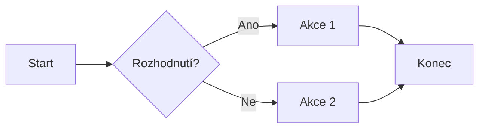
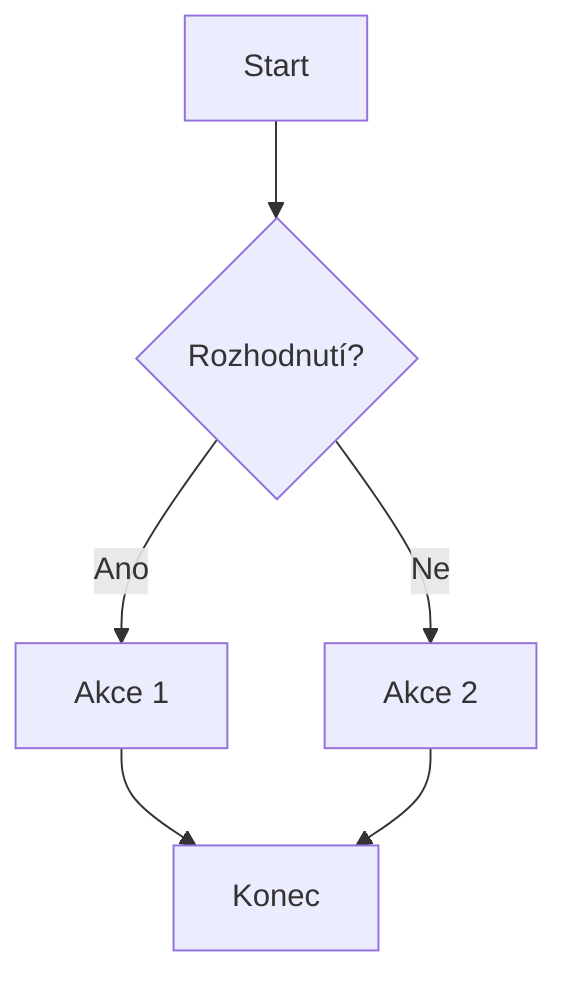
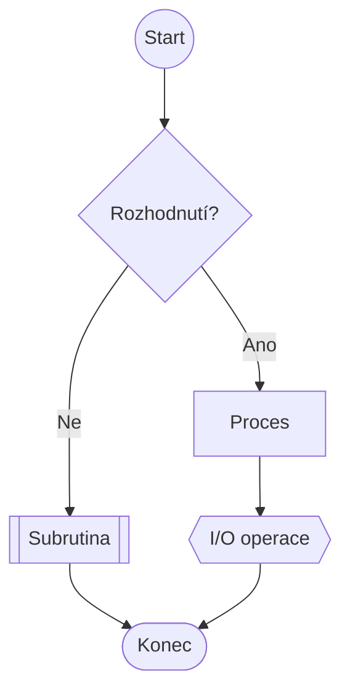

# Mermaid Sample

[Diagram Flowchart LR](#diagram-flowchart-lr)  
[Diagram Flowchart TB](#diagram-flowchart-tb)  
[Ostatní tvary](#ostatní-tvary)  
[Diagram s odkazy](#diagram-s-odkazy)

## Diagram Flowchart LR



## Diagram Flowchart TB



## Ostatní tvary



## Diagram s odkazy

```mermaid
flowchart LR
  A[Odkaz na markdown_sample] --> B{Rozhodnutí?}
  B -- Ano --> C[Akce 1]
  B -- Ne --> D[Akce 2]
  C --> E[Konec]
  D --> E

click A "https://github.com/Cliff-Diver/00_markdown_mermaid/blob/main/markdown_sample.md" "Odkaz na markdown_sample.md"
