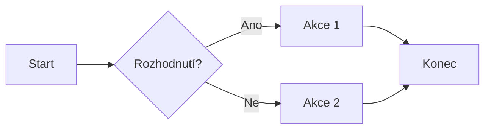
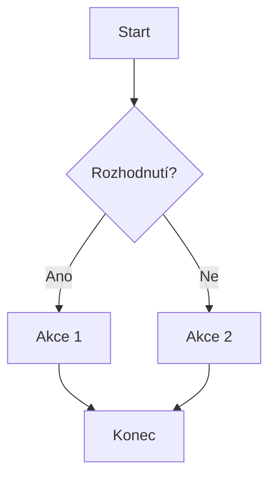

# Mermaid Sample

- [Mermaid Sample](#mermaid-sample)
  - [Diagram Flowchart LR](#diagram-flowchart-lr)
  - [Diagram Flowchart TB](#diagram-flowchart-tb)
  - [Ostatní tvary](#ostatní-tvary)
  - [Diagram s odkazy](#diagram-s-odkazy)

## Diagram Flowchart LR



## Diagram Flowchart TB



## Ostatní tvary


## Diagram s odkazy

```mermaid
flowchart LR
  A[Odkaz na markdown_sample] --> B{Rozhodnutí?}
  B -- Ano --> C[Akce 1]
  B -- Ne --> D[Akce 2]
  C --> E[Konec]
  D --> E

click A "https://github.com/Cliff-Diver/00_markdown_mermaid/blob/main/markdown_sample.md" "Odkaz na markdown_sample.md"

## Oddělené názvy uzlů a vztahy

```mermaid
graph TD
  %% Definice uzlů
  A[Analýza emailových adres]
  B[Načtení dat o OP z db.view HeN]
  C[Kontrola emailových zpráv faktury@ceskatelevize_cz – podmínky]
  D[Kopírování emailů do aiviro_fd@ceskatelevize_cz]
  E[Přesun emailů do email_transfer_copy v faktury@ceskatelevize_cz]
  F[Uložení výsledků do SQLite a CSV]
  G[Report o běhu do aiviro_fd@ceskatelevize_cz]
  H[Vytvoření logu z běhu]

  %% Vztahy
  A --> C
  C --> D
  D --> E
  E --> F
  F --> G
  G --> H
  ```
  