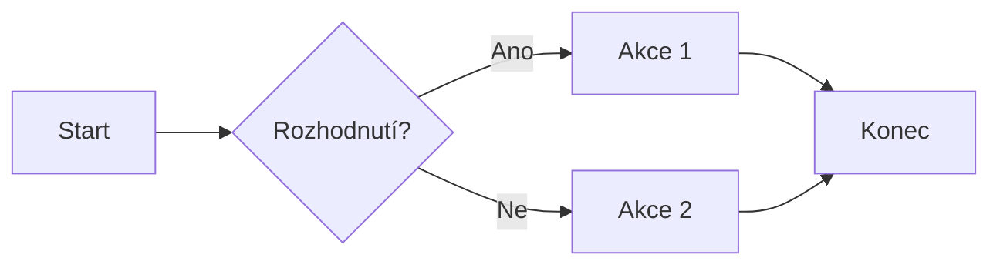

# Mermaid Sample

## Diagram Flowchart LR



## Diagram Flowchart TB

```mermaid
flowchart TB
  A[Start] --> B{Rozhodnutí?}
  B -- Ano --> C[Akce 1]
  B -- Ne --> D[Akce 2]
  C --> E[Konec]
  D --> 
```
